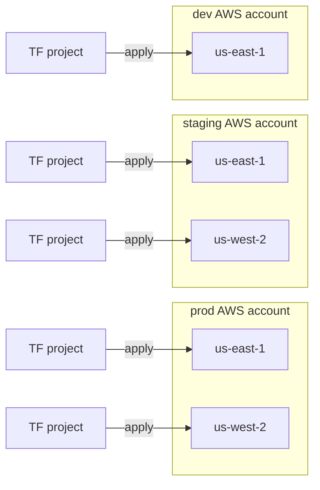
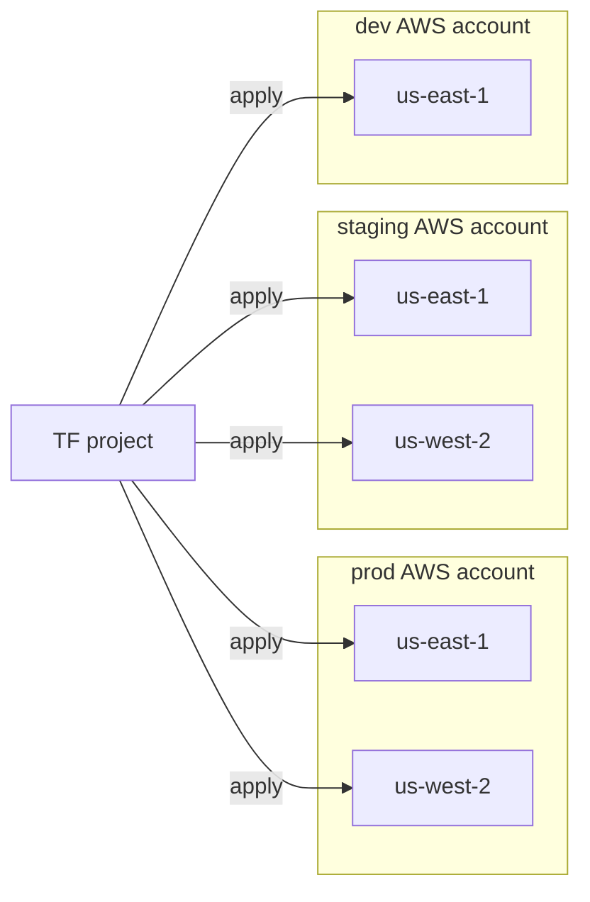
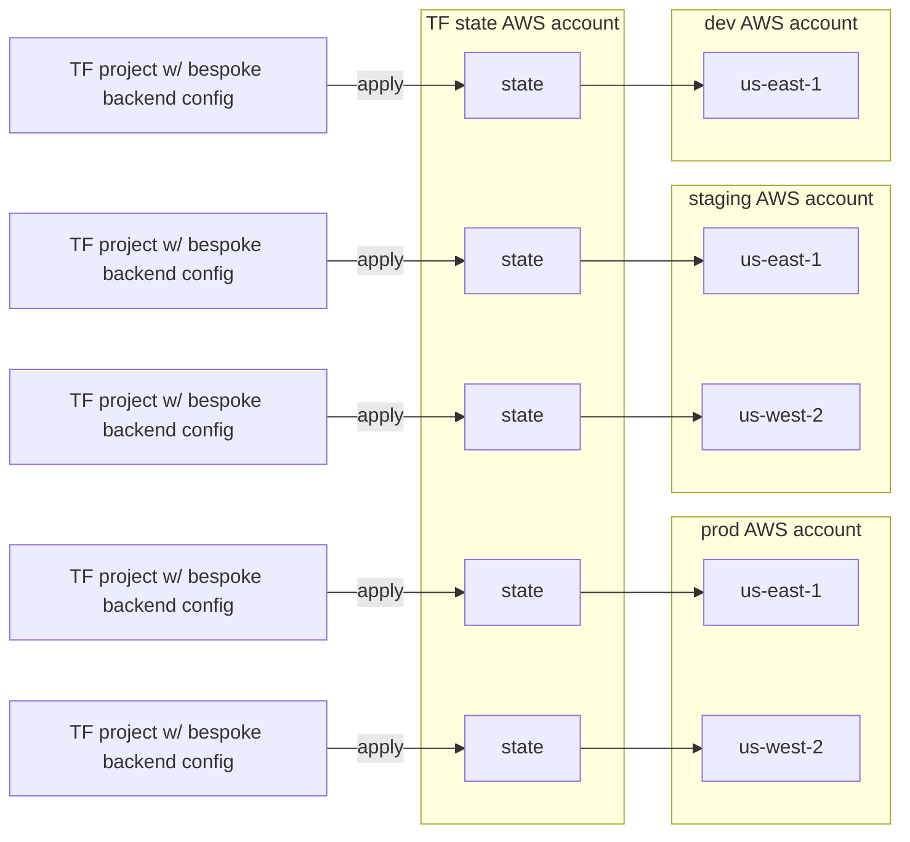
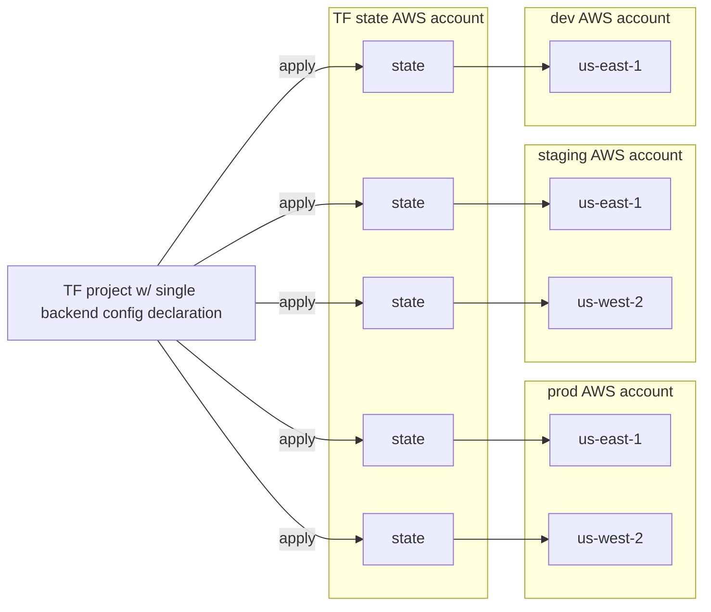
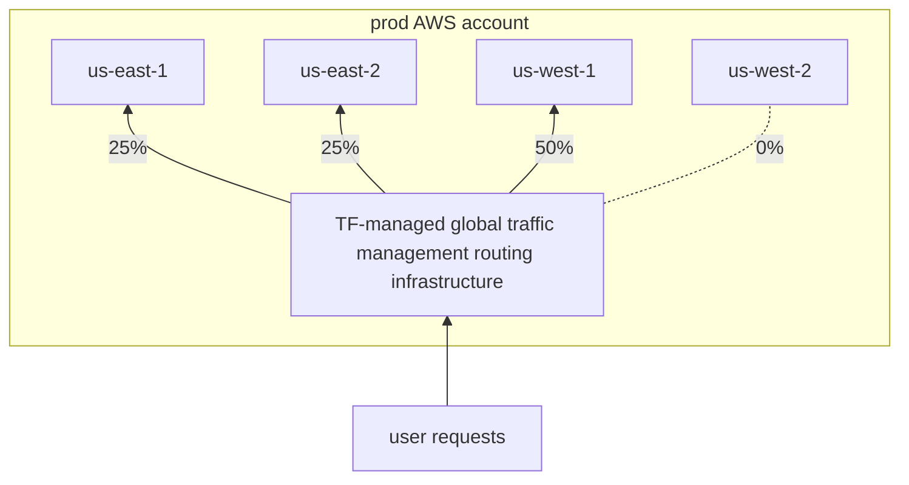
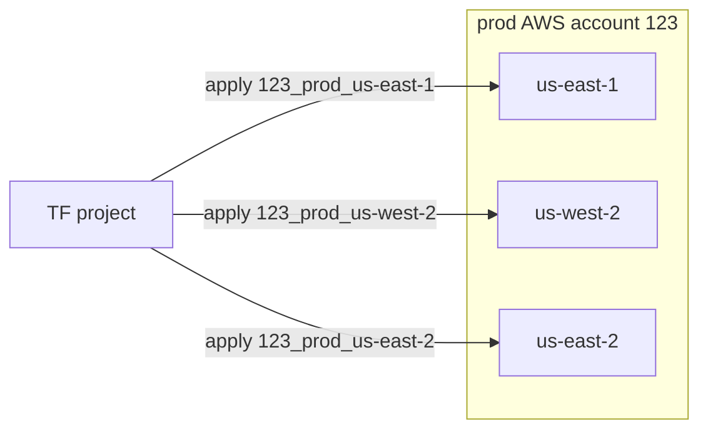
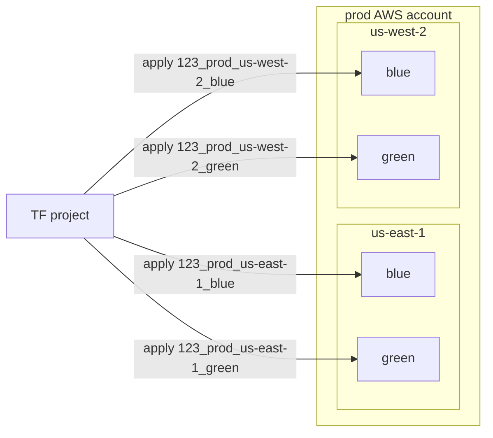
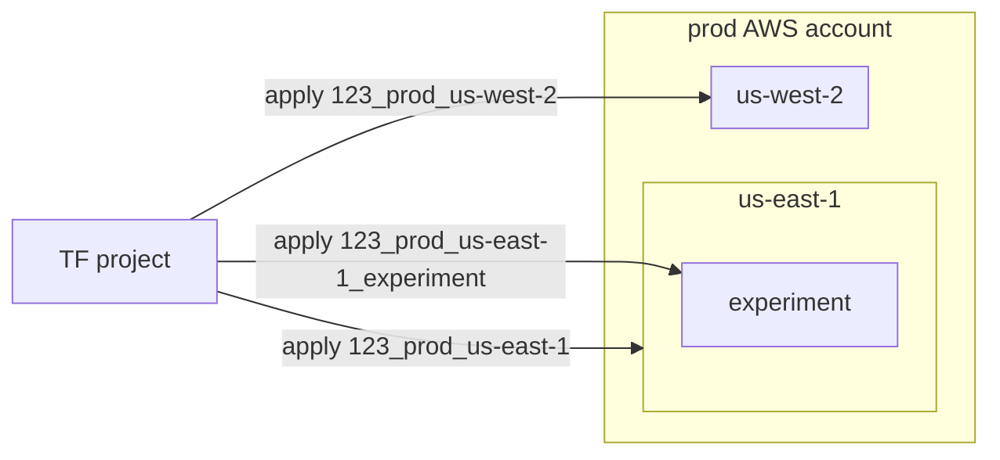
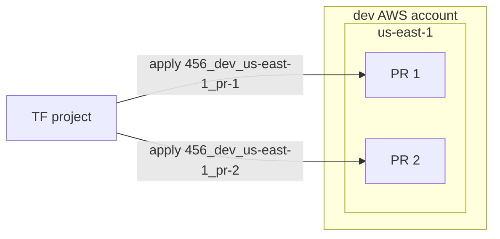
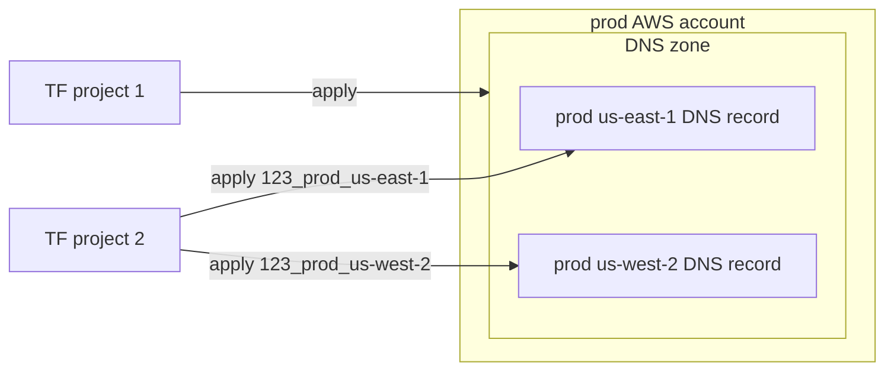

## Problem statement

As my colleague [Brian Tajuddin posits](https://www.briantajuddin.com/never-just-one/) in his _rule of never just one_:

> Writing software these days involves asking the question "How many?" over and over again. There is one answer that's always wrong.

So, here we are: you need to create and manage similar cloud infrastructure across many
different AWS account/region combinations serving different logical
environments, such as `dev`, `staging`, `prod`, etc.

For the most part, each environment should be the same as the others,
infrastructure-wise. However, there may also be necessary differences. For example:

* a `dev` environment may consist of a single AWS region, while `prod` is
  composed of multiple AWS regions.
* `prod`'s `us-west-2` region may require less compute redundancy than its
  `us-east-1` region.
* `staging`'s `foo-staging` S3 bucket is homed in its `us-west-2` region, but
  used by both its `us-west-2` and `us-east-1` regions.

How can Terraform be modeled in a scalable, reasonably [DRY](https://en.wikipedia.org/wiki/Don%27t_repeat_yourself)
fashion to serve all necessary account, region, and environment combinations
(including currently-unknown future combinations)? How can the Terraform be structured to
enforce security best practices, uniformity, and logically isolated failure domains,
while also accommodating necessary heterogeneity when/where an environment must
intentionally deviate from the others?

(Or, said a bit differently: how can corresponding Terraform infrastructure-as-code
be efficiently developed, CI'd, and CD'd without jamming all environments' configuration
into a tightly coupled monolithic mess, or subdividing and distributing it across
an unmaintainable sprawl of problematically granular and redundant projects?)

## Solution overview

In my experience, utilizing Terraform's often-overlooked [workspaces](https://developer.hashicorp.com/terraform/language/state/workspaces)
feature alongside an underscore-delimited _compound workspace naming convention_ enables elegant, scalable
Terraform reuse patterns, as well as logical infrastructure segmentation.

I call this the **compound workspace name pattern**.

Your own mileage may vary (the exact name pattern can be adapted to your organization's needs and
preferences), but `${AWS_ACCOUNT_ID}_${ENV}_${AWS_REGION}`-style
workspace names have often worked well for me. For example:

* `123_prod_us-west-2`
* `123_prod_us-east-1`
* `456_staging_us-east-1`
* `789_dev_us-east-1`

If necessary, additional, more descriptive qualifier suffixes can be appended,
too. For example:

* `123_prod_us-east-1_blue`
* `123_prod_us-east-1_green`
* `789_dev_us-east-1_pull-request-2`
* `789_dev_us-east-1_commit-1234567`

So, what's this solve for, exactly? Read on...

<div class="note">
<p>👋 NOTE: This overview largely focuses on AWS, but the compound workspace name
pattern can be used against non-AWS infrastructure providers too, or even SaaS providers
like GitHub, Datadog, PagerDuty, etc. However, doing so may require tweaking the
pattern a bit, as AWS account ID and AWS region are
likely not applicable in non-AWS contexts. For example, a compound workspace name
pattern for Terraforming GitHub could be <code>${GITHUB_ENTERPRISE_NAME}_${GITHUB_ORG_NAME}</code>.</p>
<p>Need a lil' more technical context on workspaces before reading more? See <a href="/blog/using-terraform-workspaces/">Using Terraform workspaces</a>
for some background on Terraform's <a href="https://developer.hashicorp.com/terraform/language/state/workspaces">workspaces</a> feature.</p>
</div>

## More explanation: What's this solve for?

Ultimately, the Terraform compound workspace naming pattern seeks to enable efficient, scalable, testable, reliable, and maintainable cloud infrastructure management.

### Derive context from the workspace name

Using [Terraform locals](https://developer.hashicorp.com/terraform/language/values/locals),
context can be derived dynamically from the `_`-delimited compound workspace name; those
`local` values can be used throughout other parts of the Terraform configuration:

```hcl
locals {
  workspace_parts = split("_", terraform.workspace)

  account_id = local.workspace_parts[0]
  env        = local.workspace_parts[1]
  region     = local.workspace_parts[2]
}
```

For example, resource names and tag values can utilize the context encoded in
the `local`s and derived from the workspace name:

```hcl
resource "aws_thing" "foo" {
  name = "foo-${local.env}"
  tags = {
    workspace = terraform.workspace
    env       = local.env
  }
  ...
}
```

As a result, the use of compound workspace names helps limit (or even altogether omit) a Terraform
project's [input variables](https://developer.hashicorp.com/terraform/language/values/variables),
in effect simplifying the project's public interface and thereby making it more
reliable in its behavior, more maintainable, and more simple to use.

In other words, the compound workspace names replace the practice of maintaining
-- and properly establishing -- per-`apply` input variables. Error-prone and
sometimes-awkward-to-orchestrate-in-CI/CD stuff like this is often no longer necessary:

```hcl
# Maintain per-apply TF vars.
# Conditionally set their values with each apply:
terraform plan \
  -var="region=${region}" \
  -var="env=${env}" \
  -var="account=${aws_account}"
```

Or...

```hcl
# Maintain per-apply TF vars tfvars files.
# Conditionally select and use the correct file with each apply:
terraform plan \
  -var-file="${tf_vars_file_name}.tfvars"
```

<div class="note">
<p>👋 NOTE: I'm not suggesting the use of <a href="https://developer.hashicorp.com/terraform/language/values/variables">input variables</a>
is always bad; I'm merely suggesting they should be limited to only those which
are absolutely necessary, and no more (as is the case for any programming
interface, right?).</p>
</div>

PS: The `locals`-encoded context derived from compound workspace names also enables
expressing more complex logic natively in Terraform (stay tuned; more on this in the following sections):

```terraform
resource "aws_thing" "foo" {
  count = local.env = "prod" ? 2 : 1
  ...
}
```

### Eliminate bespoke, redundant Terraform projects

Compound workspace names also head off another anti-pattern I've seen over the years: a tendency to create redundant, drift-vulnerable configurations
spanning an ever-growing collection of separate, per-environment Terraform [root module](https://developer.hashicorp.com/terraform/language/files#the-root-module)
projects, each redeclaring the same types of infrastructure (and also heads off another,
kinda-outlandish-and-hard-to-maintain-and-unnecessary practice I've seen: dynamically generating
multiple Terraform root module projects as ephemeral build artifacts).

For example, a `dev` project that doesn't utilize Terraform workspaces might
configure a resource:

```hcl
resource "aws_s3_bucket" "foo-dev" {
  bucket = "foo-dev"
  ...
}
```

...whose configuration is redeclared in separate `staging` and `prod` projects:

```hcl
resource "aws_s3_bucket" "foo-staging" {
  bucket = "foo-staging"
  ...
}
```

```hcl
resource "aws_s3_bucket" "foo-prod" {
  bucket = "foo-prod"
  ...
}
```

<div class="note">
  <p>👋 NOTE: While the use of <a href="https://developer.hashicorp.com/terraform/language/modules#child-modules">child modules</a> may facilitate some additional DRY reuse, it's still necessary
to instantiate these modules with context-specific input variables at a <code>apply</code> time too.</p>
</div>

At scale, this anti-pattern results in a sprawl of bespoke, drift-vulnerable,
environment-and-region-dedicated projects that are hard to maintain and fail to
ensure reliably consistent infrastructure:



Instead, leveraging compound workspace names, a single root module project can be re-used
across all target workspaces:

```hcl
locals {
  workspace_parts = split("_", terraform.workspace)

  account_id = local.workspace_parts[0]
  env        = local.workspace_parts[1]
  region     = local.workspace_parts[2]
}

# a single Terraform root module can be applied
# many times against different target workspaces
resource "aws_s3_bucket" "foo" {
  bucket = "foo-${local.env}"
  ...
}
```



<div class="note">
<p>👋 NOTE: I'm not necessarily suggesting all infrastructure be managed by a single, "monolithic" Terraform project.</p>
<p>Depending on needs and scale, it's likely advantagious to logically isolate
infrastructure-as-code across purpose-scoped layers. In other words, networking resources like VPC configuration could (should?) live in a networking-focused Terraform
root module project separate from projects homing higher level application resources,
like application load balancers.</p>
<p>Moreso, I'm suggesting a compound workspace naming convention can
offer a scalable pattern through which each purpose-scoped Terraform root module project
can be re-used across contexts and applied multiple times against as many target
workspaces as needed.</p>
</div>

### Avoid redeclaring state configuration over and over

Similar to how workspaces negate the need to redeclare resources across redundant
Terraform root module projects, but deserving a special callout of its own: the
use of workspaces eliminate the need to maintain multiple Terraform state configurations, too.

Without the use of workspaces, it's necessary to maintain many per-`apply` [Terraform
backend](https://developer.hashicorp.com/terraform/language/settings/backends/configuration) configurations:

```hcl
terraform {
  backend "s3" {
    bucket = "tf-state"
    key    = "prod/us-east-1/terraform.tfstate"
  }
}
```

```hcl
terraform {
  backend "s3" {
    bucket = "tf-state"
    key    = "prod/us-west-2/terraform.tfstate"
  }
}
```

```hcl
terraform {
  backend "s3" {
    bucket = "tf-state"
    key    = "dev/us-east-1/terraform.tfstate"
  }
}
```

Instead, via workspaces, a single Terraform backend state configuration scales to
serve many distinct `apply` target workspaces, automatically ensuring each
workspace's state is persisted to a distinct object path without having to
redeclare the `terraform.backend` configuration:

```hcl
terraform {
  # Terraform automatically saves each workspace's state to a distinct,
  # workspace-specific object path:
  # s3://${BUCKET}/env:/${terraform.workspace}/${KEY}
  #
  # If no workspace is specified, Terraform uses the 'default' workspace and saves
  # the state to:
  # s3://${BUCKET}/${KEY}
  backend "s3" {
    # Sidebar: Often, IME, it's useful to home this S3 bucket -- and thereby all
    # workspaces' Terraform state files -- in a central "management" AWS account.
    bucket = "tf-state"
    key    = "terraform.tfstate"
  }
}
```

In effect, multiple environment-dedicated Terraform state configurations can be
collapsed to a single configuration in a single project.

<div class="note">
<p>👋 NOTE: In my experience, it's beneficial (and perhaps even <em>necessary</em>, depending on
compliance requirements) to home Terraform state in a central "management" AWS account,
separate from user-servicing application infrastructure, hence its depiction as such in the following graphs.</p>
<p>Plus, admittedly, scaling a single backend configuration across all workspaces
requires all workspaces' Terraform states live in the same S3 bucket in the same account given that AWS requires S3 bucket names to be globally unique across all accounts.</p></div>

So, instead of project sprawl akin to this:



A single project with a single state configuration can be applied multiple times
against target workspaces:



### Logically subdivide an environment into a collection of independent, isolated failure domains

Often, in my experience, teams struggle in identifying how best to logically
model Terraform to operate on sensibly isolated subsets of infrastructure, while
also gracefully accommodating unknown scaling needs in the future. The compound
workspace name pattern helps here, too.

Because each `${AWS_ACCOUNT_ID}_${ENV}_${AWS_REGION}`-named workspace operates
on its own logical subgroup of infrastructure managed by its own [Terraform
state](https://developer.hashicorp.com/terraform/language/state), `prod`'s `us-east-1`
infrastructure can be `terraform apply`'d separately and independently from `prod`'s'
infrastructure in other regions. In effect, this limits the failure domain of Terraform
operations, ensuring better reliability of Terraform operations.

It offers some other benefits, too:

* it enables testability via progressive deployment patterns; infrastructure changes can be
  incrementally introduced to subsets of infrastructure
* individual workspace-defined subgroups of infrastructure can be efficiently destroyed (and
  recreated afresh) in isolation, if ever that's necessary.
* it paves a path towards global traffic management; a separate layer of
  Terraform can traffic shape across the workspaces via tools like [global
  accellerator](https://aws.amazon.com/global-accelerator/), [cloudfront](https://aws.amazon.com/cloudfront/), other CDN providers, or even just [weighted Route53 records](https://docs.aws.amazon.com/Route53/latest/DeveloperGuide/routing-policy-weighted.html).
  This is particularly useful in `prod` for orchestrating weighted traffic
  routing and automated failover:



### Encode logic within the Terraform configuration itself, rather than via brittle, complex orchestration scripting

In my experience with Terraform, difficult-to-maintain complexity and
brittleness often accumulates in "wrapper orchestration," such as shell scripts
and pipeline YAML that invokes `terraform` in CI/CD automation.

Often, the wrapper orchestration features special casing and branch logic that
could be better expressed natively within the Terraform HCL itself. For example:

```sh
if [[ "${}" == "prod" && "${}" == "us-west-2" ]]; then
  create_bucket="false"
else
  create_bucket="true"
fi

terraform plan \
  -var "create_bucket=${create_bucket}"
```

Instead, this logic could be expressed natively within the Terraform configuration itself:

```hcl
locals {
  workspace_parts = split("_", terraform.workspace)

  account_id = local.workspace_parts[0]
  env        = local.workspace_parts[1]
  region     = local.workspace_parts[2]

  bucket_count = {
    prod_us-west-2 = 0
  }

  default_bucket_count = 1
}

resource "aws_s3_bucket" "bucket" {
  count = try(local.bucket_count["${local.env}_${local.region}"], local.default_bucket_count)
  ...
}
```

As a result, the wrapper orchestration can be simplified; the Terraform
is more declarative, portable, self-contained, repeatable, and reliably consistent across
invocation contexts. It's no longer necessary to ensure `plan` and `apply` are always
provided the correct set of variables; the correct values are derived from the workspace
name within the Terraform itself (plus, the practice makes it easier to migrate between CI/CD platforms if ever
that's necessary).

While compound workspace naming isn't entirely to credit, the `_`-delimited workspace
naming convention offers a foundation through which best practices can easily
take root, and logic is declaratively codified in Terraform itself.

### Guarantee uniformity while accommodating heterogeneity

Because all workspaces are managed via the same Terraform configuration,
reliable uniformity across environments is fairly guaranteed. At the same time,
per-environment -- or per-region -- variability can be easily accommodated too.

For example, the compound workspace name offers a toehold through which Terraform can
natively express that a particular S3 bucket be created everywhere _except_
`prod`'s `us-west-2` region:

```hcl
locals {
  workspace_parts = split("_", terraform.workspace)

  account_id = local.workspace_parts[0]
  env        = local.workspace_parts[1]
  region     = local.workspace_parts[2]

  bucket_count = {
    prod_us-west-2 = 0
  }

  default_bucket_count = 1
}

resource "aws_s3_bucket" "bucket" {
  count = try(local.bucket_count["${local.env}_${local.region}"], local.default_bucket_count)
  ...
}
```

As such, intentional deviation is codified in a clear, discoverable, self-evident,
fashion.

### Accommodate new accounts, regions, environments, etc. without requiring new Terraform code

Adding support for additional account/environment/region combinations generally
requires no real Terraform development; simply `apply` the existing Terraform
against a new workspace, reducing the lead associated with new environments'
creation.

For example, consider a `prod` environment composed of infrastructure in `us-east-1`
and `us-west-2`. Establishing a third `us-east-2` `prod` region is fairly low
effort: `apply` to a new `${AWS_ACCOUNT_ID}_prod_us-east-1` workspace:



<div class="note">
<p>👋 NOTE: In <a href="https://github.com/mdb/tf-workspaces-demo/">tf-workspaces-demo</a> I offer a demo, showing how adding
support for additional accounts, environments, and/or regions to the GitHub
Actions-based CI/CD pipeline merely requires adding the new workspace name to a
<a href="https://github.com/mdb/tf-workspaces-demo/blob/main/workspaces.json">workspaces.json</a> configuration file
(Admittedly, this might be a bit more complex in a real world scenario, though my point
remains: the Terraform and CI/CD pipelines scale to accommodate new
tenancy relatively easily).</p>
</div>

The compound workspace naming pattern also enables the creation of additional logical _subgroupings_ of existing
account/region/environment combinations. For example, `_blue` and `_green` suffixes could be used to enable blue/green infrastructure deployments via
distinct `1234_prod_us-west-2_blue` and `1234_prod_us-west-2_green` workspaces:



...or one-off experimental subset deployments could leverage an additional
`_${DESCRIPTOR}` workspace suffix, such as `${AWS_ACCOUNT_ID}_${ENV}_${REGION}_2024-06-30-experiment`,
to establish even more granular "sub-environment" workspaces:



...or ephemeral pull-request-based deployments could leverage per-PR
workspace names a la `${AWS_ACCOUNT}_dev_us-east-1_pr-1`, for example, enabling
previewing, demoing, and testing PR code in advance of a merge to `main`:



### Create logical relationships between resources spanning multiple Terraform projects

Compound workspace naming also offers a simple, standardized, and maintainable pattern
for expressing and managing dependency relationships between infrastructure
resources managed by _separate_ Terraform projects dedicated to different
layers of concern. For example:

* foundational VPC and networking configuration might be managed by a
`terraform-vpc` project, while a higher level `terraform-eks` project manages the
deployment of EKS clusters to the resulting VPCs.
* a `terraform-dns` project might manage common, foundational DNS infrastructure,
such as a `.foo.bar` zone, while `terraform-my-application` manages `my-application`-specific resources

So, how could `terraform-eks` dynamically consume the necessary VPC details without
requiring that such details be passed as hard-coded [input variables](https://developer.hashicorp.com/terraform/language/values/variables), or fetched from [outputs](https://developer.hashicorp.com/terraform/language/values/outputs) via a [terraform_remote_state data source](https://developer.hashicorp.com/terraform/language/state/remote-state-data), or making bittle, hard-to-scale
assumptions that tightly couple it to `terraform-vpc` and the VPCs' exact infrastructure-as-code implementation?

A common workspace naming convention offers a toehold for expressing and resolving
dependency relationshps via Terraform [data
sources](https://developer.hashicorp.com/terraform/language/data-sources) and
standardized tagging:

```hcl
data "aws_vpc" "vpc" {
  tags {
    Workspace = terraform.workspace
    # Alternatively, this could also leverage other tags.
    # For example:
    # Env = local.env
  }
}

data "aws_subnet_ids" "subnets" {
  vpc_id = data.aws_vpc.vpc.id
}

resource "aws_eks_cluster" "cluster" {
  vpc_config {
    subnet_ids = data.aws_subnet_ids.subnets.ids
  ...
}
```

As such, `terraform-eks` is agnostic to the VPC's infrastructure-as-code implementation; it merely
configures the subnets homed within the VPC whose `Workspace` tag corresponds
to its own `terraform.workspace`.

Similarly, `terraform-my-application` can dynamically fetch the DNS zone corresponding
to its `terraform.workspace`:

```hcl
# https://registry.terraform.io/providers/hashicorp/aws/latest/docs/data-sources/route53_zone#tags
data "aws_route53_zone" "zone" {
  tags {
    Workspace = terraform.workspace
    # Alternatively, this could also leverage other tags.
    # For example:
    # Env = local.env
  }
}

resource "aws_route53_record" "my-application" {
  zone_id = data.aws_route53_zone.zone.zone_id
  ...
}
```



These are fairly crude, contrived examples, but more advanced applications are possible
too.

### Enforce governance via policy-as-code constraints expressed in native Terraform HCL

Security, reliability, and governance guardrails -- or even functional testing,
to some extent -- can be baked into the Terraform
configuration and expressed as native HCL (rather than bolted on via an additional
complexity-adding tool, such as [OPA](https://mikeball.info/blog/terraform-plan-validation-with-open-policy-agent/), [Terratest](https://mikeball.info/blog/automated-terraform-plan-analysis-with-terratest/) or [checkov](https://www.checkov.io/)). The compound
workspace naming scheme helps here, too.

For example, the `terraform.workspace` can be used to impose an [allowed_account_ids](https://registry.terraform.io/providers/hashicorp/aws/latest/docs#allowed_account_ids)
constraint on the AWS provider configuration. This ensures an environment is never
`plan`/`apply`'d to the wrong AWS account:


```hcl
locals {
  workspace_parts = split("_", terraform.workspace)

  account_id = local.workspace_parts[0]
  region     = local.workspace_parts[1]
  env        = local.workspace_parts[2]

  supported_accounts_per_env = {
    prod     = ["123"]
    dev      = ["456"]
    staging  = ["789"]
  }
}

provider "aws" {
  # Ensure an environment is never plan/apply'd against the wrong account.
  allowed_account_ids = [local.supported_accounts_per_env[local.env]]
...
}
```

Similarly, the `terraform.workspace` value can drive [custom conditions](https://developer.hashicorp.com/terraform/language/expressions/custom-conditions)
that validate a configuration and protect against unintended and problematic
operations. Consider the following kinda-contrived-but-hopefully-still-helpful
example:

```hcl
locals {
  workspace_parts = split("_", terraform.workspace)

  account_id = local.workspace_parts[0]
  env        = local.workspace_parts[1]
  region     = local.workspace_parts[2]
}

data "aws_subnet" "application" {
  filter {
    name   = "tag:TerraformWorkspace"
    values = [terraform.workspace]
  }
}

resource "aws_security_group_rule" "ingress" {
  ingress {
    cidr_blocks = [data.aws_subnet.application.cidr_block]
    ...
  }

  lifecycle {
    # Never allow ingress to non-prod environments from the world.
    precondition {
      condition     = data.aws_subnet.application.cider_block != "0.0.0.0/0" || local.env == "prod"
      error_message = "Ingress to non-prod environment must not include 0.0.0.0/0."
    }
  }
  ...
}
```

<div class="note">
<p>👋 NOTE: I've got no beef with the aforementioned policy-as-code tools. In fact, I
quite like 'em and appreciate that free, non-<a href="https://developer.hashicorp.com/terraform/cloud-docs/policy-enforcement/sentinel">sentinal</a>
open source options exists. But why require additional
complexity in scenarios where native Terraform can do the job?</p>
</div>

## FAQs

### What's the point of the `${AWS_ACCOUNT_ID}_` prefix? Why not simply use `${ENV}_${REGION}` workspace names?

YMMV! You could simplify the workspace naming convention to `${ENV}_${REGION}`, then
dynamically select the correct account ID via logic like the following:

```hcl
locals {
  account_ids = {
    dev     = "123"
    staging = "456"
    prod    = "789"
  }

  workspace_parts = split("_", terraform.workspace)

  env    = local.workspace_parts[0]
  region = local.workspace_parts[1]
}

provider "aws" {
  allowed_account_ids = [local.account_ids[local.env]]
  region              = local.region
}
```

However, prefixing the workspace name with an account ID accounts for the
possibility that an environment, such as `prod`, may be composed of resources
spanning multiple AWS accounts, as is common in large organizations.

<div class="note">
<p>👋 NOTE: If it tastes better, the compound workspace name scheme could also be tweaked
a bit, based on your needs and preferences: <code>${ENV}_${AWS_ACCOUNT_ID}_${AWS_REGION}</code>, for example. Really, I tend to think the important part is maintaining a pattern that can be reliably <a href="https://developer.hashicorp.com/terraform/language/functions/split">parsed</a> in a scalable fashion, especially if/when it's necessary to append additional qualifer suffixes.</p>
</div>

### What about [terragrunt](https://terragrunt.gruntwork.io/)?

In some ways, [terragrunt](https://terragrunt.gruntwork.io/) claims to solve some of
the above-described repeatability challenges by wrapping and extending core Terraform
functionality. In many contexts, [terragrunt](https://terragrunt.gruntwork.io/) (and similar tools)
are great. However, their use invites additional complexity (and, in turn, invites additional questions about
how best to structure IaC across account, region, and environment boundaries). Often,
in my experience, well-modeled Terraform workspaces are sufficient without the additional
tooling.

### How's all this relate to [Terraform child modules](https://developer.hashicorp.com/terraform/language/modules#child-modules)? Aren't child modules intended to enable reuse?

Generally, Terraform child modules and workspaces address slightly different
problems; their use is not mutually exclusive.

Workspaces facilitate the ability to apply a single Terraform project configuration against multiple
target contexts (each with a corresponding isolated Terraform [state](https://developer.hashicorp.com/terraform/language/state)). By contrast, child modules are more simply generic
abstractions of opinionated Terraform "recipes."

Modules often target specific resources (or combinations of resources), but are
largely agnostic to the surrounding project context. Child modules can be consumed by and used
within parent Terraform projects, though they cannot be applied independently;
they have no project-specific [state](https://developer.hashicorp.com/terraform/language/state)
and [provider](https://developer.hashicorp.com/terraform/language/providers) configuration.
As such, child modules enable reuse and [composability](https://developer.hashicorp.com/terraform/language/modules/develop/composition) -- and/or enforce best practices governance -- along different dimensions of concern.

### Couldn't the workspace-encoded data, like `region`, be an [input variable](https://developer.hashicorp.com/terraform/language/values/variables)?

Rather than being encoded in the compound workspace naming convention, the
Terraform project could utilize a `var.region` input variable, yes.

However, in my experience, this can lead to two problems:

1. Workspace naming collision. For example, `123_dev`'s `us-east-1` and `123_dev`'s `us-west-2` deployments would no longer have unique workspace names.
2. Workspace S3 state collision. For example, Terraform would attempt to use `s3://${BUCKET}/env:/123_dev/terraform.tfstate` for both `123_dev`'s `us-east-1` and `123_dev`'s `us-west-2` applications.

(And a third, bonus problem: CI/CD automation must now express when/where/how to
set `var.region` and therefore incur additional complexity. And _and_: I like to
use as few input variables as possible to keep Terraform projects' public interface
simple, as I mention earlier on.)

### Why is the compound name underscore-delimited?

By using an `_` to delimit the parts of the compound workspace name, Terraform's
[split](https://developer.hashicorp.com/terraform/language/functions/split)
function can be used to parse the workspace name:

```terraform
locals {
  workspace_parts = split("_", terraform.workspace)

  account_id = local.workspace_parts[0]
  env        = local.workspace_parts[1]
  region     = local.workspace_parts[2]
}
```

The `_` delimination is reasonably easy for humans to read and understand, and
preserves AWS's `-`-delimited region names when those region names appear as
part of the compound workspace name.

Plus, additional, nonbreaking qualifier suffixes can be
appended if/when increasingly granular workspaces are needed. These additional qualifiers can use `-` to facilitate human readability,
as well as machine parsing:

```terraform
locals {
  workspace_parts = split("_", terraform.workspace)

  account_id = local.workspace_parts[0]
  env        = local.workspace_parts[1]
  region     = local.workspace_parts[2]

  # optionally parse an additional _pr-${PR_NUMBER} workspace name part.
  pr        = try(local.workspace_parts[3], "")
  pr_number = local.pull_request != "" ? split(local.pull_request, "-")[1] : ""
}
```

### What about non-AWS providers?

How does the compound workspace naming scheme work with non-AWS providers, such
as GitHub, Datadog, Grafana, etc.?

Often, I recommend tweaking the workspace naming scheme according to needs and
context. A few example options include:

* `${DATADOG_ACCOUNT_ID}_${ENV}`
* `${GITHUB_ENTERPRISE_NAME}_${GITHUB_ORG}`
* `${ENV}` (I admit: in some contexts, a simple ol' environment name is good enough)

### What about "global" configurations?

Generally, I recommend a few approaches when dealing with "global" configuration
that isn't necessarily associated with an AWS region or a particular environment (For example:
a Route53 zone that is not associated with a region and is used across all environments).

You'll need to decide which approach is most appropriate for your context. Options include:

1. `${AWS_ACCOUNT_ID}_${ENV}_${AWS_REGION}` - continue with the standard
   compound naming pattern. Use [conditional logic](https://developer.hashicorp.com/terraform/language/expressions/conditionals)
   and a [count = 0](https://developer.hashicorp.com/terraform/language/meta-arguments/count) to control
   the workspaces responsible for the resources' management.
1. `${AWS_ACCOUNT_ID}_${ENV}_global` - maintain non-region-specific "global"
   workspaces within each environment, as needed.
1. `${AWS_ACCOUNT_ID}_global` - maintain non-environment-and-region-specific
   "global"  workspaces within each account, as needed.
