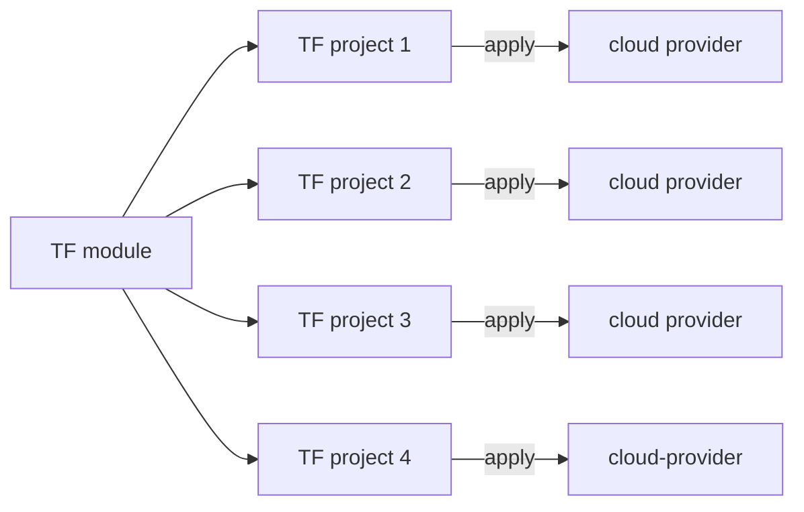
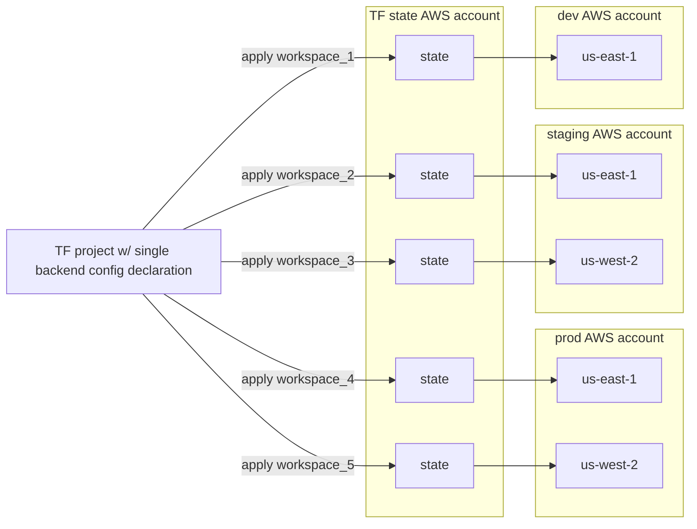
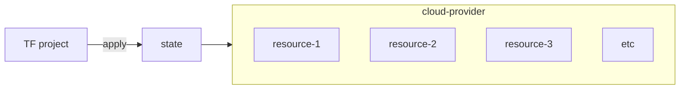

## Child modules: Generic, composable "recipes"

Terraform [child modules](https://developer.hashicorp.com/terraform/language/modules#child-modules) offer a mechanism for abstracting, packaging, and re-using common Terraform
resource configurations across multiple distinct Terraform projects. Child modules expose a simple interface to
a more complex underlying configuration, similar to a programming language library or class; they're generic
abstractions of opinionated Terraform "recipes:"



Overview:

* often have their own build/test/version/release CI/CD lifecycle separate and independent
  from (and agnostic to) their consumption and use amongst dependent projects (like a library, an NPM module, or a Go package, or a [marketplace GitHub Action](https://github.com/marketplace?type=actions))
* enable platformization by decoupling _capability enablement_ from the _use of enabled capabilities_
* can be external or in-house
* can be sourced from the local file system, an HTTP endpoint, git repositories, or
  from a [Terraform registry](https://registry.terraform.io/browse/modules)
* rich [open source community](https://registry.terraform.io/browse/modules)

For example, a specific version of the [cloudpossee/terraform-aws-dynamodb](https://github.com/cloudposse/terraform-aws-dynamodb) module can be sourced from the public [Terraform registry](https://registry.terraform.io/modules/cloudposse/dynamodb/aws/latest) and instantiated within a Terraform root module project configuration:

```terraform
module "main" {
  source  = "cloudposse/dynamodb/aws"
  version = "0.33.0"

  name              = "my-table"
  namespace         = "eg"
  hash_key          = "HashKey"
  range_key         = "RangeKey"
  enable_autoscaler = false
}
```

## Workspaces: apply a single root module project against multiple targets

Terraform [workspaces](https://developer.hashicorp.com/terraform/language/state/workspaces) facilitate the ability to apply a single Terraform [root module](https://developer.hashicorp.com/terraform/language/modules#the-root-module) project configuration against multiple
target contexts; each workspace gets a corresponding distinct and isolated Terraform [state](https://developer.hashicorp.com/terraform/language/state)).



Overview:

* create multiple, logical groupings of resources – each associated with its own, independent [Terraform state](https://developer.hashicorp.com/terraform/language/state) and name – from a single Terraform configuration
* common use case: apply the same project configuration against multiple named environments, such as `dev`, `staging`, and `prod`
* See [Scalable Terraform patterns: compound workspace names](/blog/scalable-terraform-patterns-compound-workspace-names/) and [Using Terraform workspaces](/blog/using-terraform-workspaces/) for more details.

For example, consider a simple root module project with a single [terraform
backend](https://developer.hashicorp.com/terraform/language/settings/backends/configuration) configuration:

```terraform
terraform {
  # Terraform automatically saves each workspace's state to a distinct,
  # workspace-specific object path:
  # s3://${BUCKET}/env:/${terraform.workspace}/${KEY}
  #
  # If no workspace is specified, Terraform uses the 'default' workspace and saves
  # the state to:
  # s3://${BUCKET}/${KEY}
  backend "s3" {
    bucket = "tf-state"
    key    = "terraform.tfstate"
  }
}

resource "some_resource" "resource" {
  name = terraform.workspace
}
```

The project can be applied against multiple named workspace targets; each
workspace's Terraform state is persisted to a distinct S3 object path, isolating
workspace operations:

```
terraform workspace select -or-create "foo"
...
terraform plan
...
terraform apply
...
```
```
terraform workspace select -or-create "bar"
...
terraform plan
...
terraform apply
...
```

## Built-in constructs: Enable HCL DRY-ness and logic within a root or child module

Additionally, Terraform offers various built-in constructs for authoring
elegant, [DRY](https://en.wikipedia.org/wiki/Don%27t_repeat_yourself) [HCL](https://github.com/hashicorp/hcl) and expressing logic _within_ a Terraform configuration. These
constructs enable reasonably minimal Terraform HCL to manage a large volume of
resources:



Overview:

* the [for_each](https://developer.hashicorp.com/terraform/language/meta-arguments/for_each) and [count](https://developer.hashicorp.com/terraform/language/meta-arguments/count) meta-arguments
  allow a single HCL resource block to operate on multiple infrastructure objects.
* support for [dynamic blocks](https://developer.hashicorp.com/terraform/language/expressions/dynamic-blocks) enables repeatable nested blocks within a single HCL resource
* various [logical operators](https://developer.hashicorp.com/terraform/language/expressions/operators) and [conditionals](https://developer.hashicorp.com/terraform/language/expressions/conditionals) enable
  conditional logic
* [local values](https://developer.hashicorp.com/terraform/language/values/locals) assigns a name to an [expression](https://developer.hashicorp.com/terraform/language/expressions), negating the need to
  repeat the expression throughout a Terraform configuration
* built-in [functions](https://developer.hashicorp.com/terraform/language/expressions/function-calls) offer helpful utilities
* See [Advanced Terraform Logic](/blog/advanced-terraform-logic/) for an overview tying much of this together

As a contrived example, consider the following Terraform configuration;
leveraging some of the above-described contexts, relatively minimal HCL can
scales to manage an infinite number of resources.

```terraform
locals {
  # grafana_dashboards reads a YAML file encoding a list of desired dashboard names
  # into a local variable.
  grafana_dashboards = yamldecode(file("${path.module}/dashboards.yaml"))

  # grafana_folders is a list of unique folder names.
  grafana_folders = distinct([
    for dashboard in local.grafana_dashboards : dashboard.folder
  ])
}

# grafana_folder.all creates a Grafana folder for each grafana_folders item.
resource "grafana_folder" "all" {
  for_each = toset(local.grafana_folders)

  title = each.value
}

# grafana_dashboard.all creates a Grafana dashboard for each grafana_dashboards item.
resource "grafana_dashboard" "all" {
  for_each = { for dashboard in local.grafana_dashboards : dashboard.dashboard => dashboard }

  folder      = grafana_folder.all[each.value.folder].id
  config_json = jsonencode({
    title = each.value.dashboard,
    uid   = replace(lower(each.value.dashboard), "_", "-")
  })
}
```
