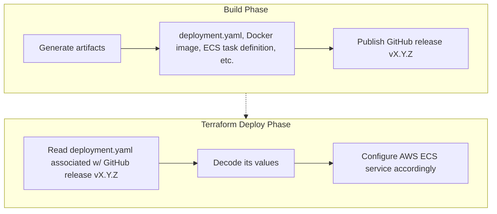

_Recently, I [contributed](https://github.com/integrations/terraform-provider-github/pull/2514)
the [github_release_asset](https://registry.terraform.io/providers/integrations/github/latest/docs/data-sources/release_asset) data source to the
GitHub Terraform provider. It's now available in [v6.10.3+ releases](https://github.com/integrations/terraform-provider-github/releases) of the
provider._

## TL;DR example

```terraform
# Fetch the my-org/my-app GitHub release associated with a tag.
data "github_release" "latest" {
  repository  = "foo"
  owner       = "my-org"
  retrieve_by = "latest"
}

# Fetch the deployment.yaml manifest associated with the GitHub release.
data "github_release_asset" "deployment_config" {
  repository             = "foo"
  owner                  = "my-org"
  asset_id               = [
    for asset in data.github_release.latest.assets :
    asset.id if asset.name == "deployment.yaml"
  ][0]
  download_file_contents = true
}
```

## Use case

Your organization's CI/CD pipeline features distinct, loosely coupled _build_
and _deploy_ phases.

At a _build_ phase, your organization builds and publishes build artifacts --
including deployment configuration data -- as GitHub release assets.

For example, container image URIs, Kubernetes deployment descriptors, an application
version manifest, or environment-specific configuration encoded in JSON or YAML
is attached to each semantically-versioned GitHub release.

Later, at a _deploy_ phase -- decoupled from the _build_ phase -- you'd like to
read release assets' contents in Terraform and use the assets' values to drive
parameterized resource configurations applied to the targeted environment.

As an example, consider a CI/CD pipeline targeting AWS ECS :



Previously, accomplishing this with the
[GitHub Terraform provider](https://registry.terraform.io/providers/integrations/github/latest/docs)
required workarounds: shelling out via a `local-exec` provisioner, using an
`external` data source, or fetching the asset outside Terraform and passing its
contents as a variable.

## Solution

```terraform
variable "release" {
  type        = string
  description = "The semantically versioned tag associated with the GitHub release to deploy"
}

# Fetch the my-org/foo GitHub release associated with a tag.
data "github_release" "latest" {
  repository = "foo"
  owner      = "my-org"
  tag_name   = var.release
}

# Fetch the deployment.yaml manifest associated with the GitHub release.
data "github_release_asset" "deployment_config" {
  repository             = "foo"
  owner                  = "my-org"
  asset_id               = [
    for asset in data.github_release.latest.assets :
    asset.id if asset.name == "deployment.yaml"
  ][0]
  download_file_contents = true
}

# Decode the deployment.yaml manifest.
locals {
  deployment_config = yamldecode(
    base64decode(data.github_release_asset.deployment_config.file_contents)
  )
}

# Use local.deployment_config.* values to drive Terraform configuration.
resource "aws_ecs_service" "foo" {
  task_definition = local.deployment_config.task_arn
  ...
```

Then, to apply a specific versioned release (including a past release; in
theory, the pattern could also drive rollbacks):

```
terraform apply \
  -var "release=v1.0.3"
```

## Benefits

- **Native Terraform integration**: no need for `local-exec` provisioners,
  `external` data sources, or pre-fetching assets outside Terraform
- **Plan-time visibility**: `terraform plan` shows the exact configuration
  values that will be applied
- **Version-controlled deployments**: deploy any release by specifying its tag;
  the same mechanism supports rollbacks to previous versions
- **Decoupled build and deploy**: build artifacts are immutably versioned in
  GitHub releases; the deploy phase reads them without tight coupling
- **Single source of truth**: GitHub releases serve as the authoritative source
  for deployment configuration, container image URIs, task definitions, etc.
- **Built-in UI and API**: GitHub provides a web interface for browsing
  releases, viewing changelogs, and downloading assets, plus a REST API for
  programmatic access beyond Terraform
