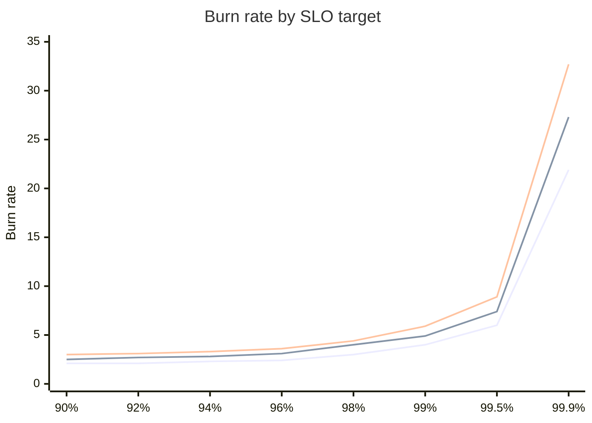
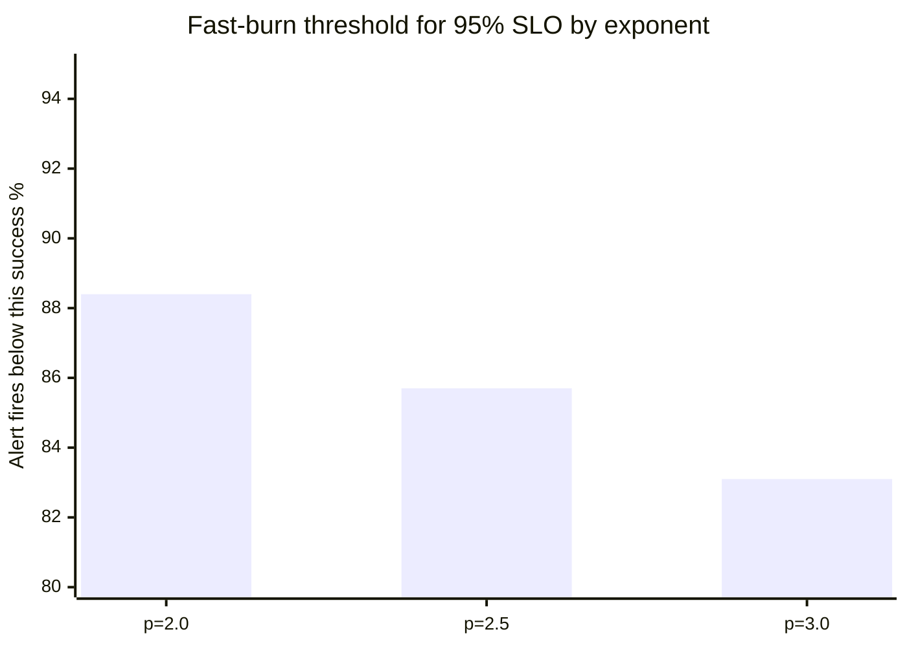

_The standard multi-window, multi-burn-rate alerting pattern from the [Google
SRE Workbook](https://landing.google.com/sre/workbook/chapters/alerting-on-slos/#6-multiwindow-multi-burn-rate-alerts)
works well for 99.9%+ SLOs. For lower targets, it produces thresholds that
range from impossible to breach (90%) to so lenient they only fire during total
outages (95%). SLO-adaptive burn rates fix this by scaling the burn rate with
the SLO target._

## The problem with fixed burn rates

The Google SRE pattern defines burn rates as a fraction of your error budget
consumed over a time window. For a 30-day SLO with a 1-hour fast-burn alert
window:

```
burn_rate = 0.02 * 720 = 14.4
            ^      ^
            |      hours in 30 days (24 * 30)
            2% of error budget
```

This means "alert when you'd burn 2% of your 30-day budget in 1 hour." The
monitor threshold is:

```
threshold = 100 - (burn_rate * (100 - slo_target))
```

For a 99.9% SLO, this gives a threshold of 98.56% -- a meaningful signal that
something is wrong.

But plug in a 90% SLO:

```
threshold = 100 - (14.4 * 10) = -44%
```

A success rate can't go below 0%, so this monitor can never fire. The same
problem appears at 95% (threshold: 28%) and even 99% (threshold: 85.6%, which
is arguably too lenient for a 1-hour window on a 99% SLO).

The root cause: the fixed burn rate of 14.4 is calibrated for a very small
error budget (0.1%). When the budget is larger (1%, 5%, 10%), that same
multiplier overshoots.

## SLO-adaptive burn rates

Instead of a fixed multiplier, compute the burn rate as a function of the SLO
target itself. In other words, a 90% SLO should tolerate a higher error rate
before alerting than a 99.9% SLO, so the burn rate should be lower:

```
B(SLO) = (100 - 100 * ((SLO - 1) / 100)^2.5) / (100 - SLO)
```

The exponent 2.5 controls how aggressively the burn rate scales. Higher
exponents produce more aggressive (higher) burn rates for high SLOs; lower
exponents flatten the curve.

This gives burn rates that scale naturally:

| SLO Target | Adaptive Burn Rate | Fixed Burn Rate (30d) | Threshold |
|------------|-------------------|-----------------------|-----------|
| 90%        | 2.53              | 14.4                  | 74.7%     |
| 95%        | 2.87              | 14.4                  | 85.7%     |
| 99%        | 4.93              | 14.4                  | 95.1%     |
| 99.9%      | 27.27             | 14.4                  | 99.73%    |

For high SLOs, the adaptive rate actually exceeds the fixed rate. Cap it
with `min()` to preserve the original behavior where it already works:

```
burn_rate_fast = min(fixed_rate, behavior_rate)
```

This way, 99.9% SLOs get the same thresholds they've always had, while lower
SLOs get monitors that can actually fire.

## Calibration

The formula is calibrated for 30-day windows. To understand why window size
matters: the fixed burn rate scales linearly with the SLO period
(`0.02 * period_hours`), but the adaptive rate depends only on the SLO
target. For a 90-day window, the fixed rate is 43.2 while the behavior rate for
99.9% is 27.27 -- the cap wouldn't apply, and the thresholds would shift.

If you need other windows, you'd need to recalibrate the exponent or introduce
a window-dependent term. For most teams, 30-day windows are the standard and
this isn't a concern.

The exponent of 2.5 is a reasonable default. You can think of it as a dial:

- **Lower exponent (e.g. 2.0)**: flatter curve, lower burn rates across the
  board, less sensitive alerting
- **Higher exponent (e.g. 3.0)**: steeper curve, higher burn rates for high
  SLOs, more aggressive alerting



_Bottom to top: p=2.0 (flattest), p=2.5 (default), p=3.0 (steepest). All three
converge at lower SLO targets and diverge sharply above 99%._

Plot the function for a few exponents and pick the one that gives thresholds
your team considers actionable. Here's an example of how to do that.

### Example: choosing an exponent for a 95% SLO

Suppose your team runs a service with a 95% SLO on a 30-day window. You want
to pick an exponent that alerts early enough to be useful, but not so
aggressively that it fires on brief, harmless dips.

Compute the burn rate and resulting fast-burn (1h) and slow-burn (4h) alert
thresholds for each candidate exponent:

| Exponent | Burn Rate | Fast Threshold (1h) | Slow Threshold (4h) |
|----------|-----------|--------------------:|--------------------:|
| p=2.0    | 2.33      |               88.4% |               92.2% |
| p=2.5    | 2.87      |               85.7% |               90.4% |
| p=3.0    | 3.39      |               83.1% |               88.7% |

Read these thresholds as: "the 1-hour fast-burn monitor fires when the success
rate drops below X%." So the question becomes: for a service with a 95% target,
what 1-hour success rate should wake someone up?

- **p=2.0** fires at 88.4%. Conservative -- only alerts when errors are roughly
  double the budget rate. Good for noisy services where brief dips are normal.
- **p=2.5** fires at 85.7%. A middle ground. Alerts when errors are nearly
  triple the budget rate over an hour.
- **p=3.0** fires at 83.1%. More lenient -- tolerates higher error spikes
  before alerting. Better for services with bursty traffic patterns.



The slow-burn thresholds follow the same pattern but are closer to the SLO
target, catching sustained degradation over 4 hours that the fast-burn window
might miss.

To decide which exponent fits your service, look at its recent metrics. If it routinely dips to 90%
for a few minutes during deployments, p=2.0 (threshold 88.4%) would alert on
those dips while p=3.0 (threshold 83.1%) would not. Pick the exponent that
separates real incidents from normal variance for your service.

## Implementing in Terraform

Here's what this looks like as a Terraform module for Datadog SLO monitors:

```terraform
variable "slo_target" {
  description = "SLO target percentage (e.g. 99.0 for 99%)"
  type        = number
}

locals {
  slo_period_hours = 720 # 30 days

  # B(SLO) = (100 - 100 * ((SLO - 1) / 100)^2.5) / (100 - SLO)
  behavior_burn_rate = (
    (100 - 100 * pow((var.slo_target - 1) / 100, 2.5))
    / (100 - var.slo_target)
  )

  # Cap at fixed Google SRE rates for high SLOs.
  burn_rate_fast = min(0.02 * local.slo_period_hours, local.behavior_burn_rate)
  burn_rate_slow = min(
    0.05 * local.slo_period_hours / 4,
    local.behavior_burn_rate * 2 / 3,
  )

  threshold_fast = 100 - (local.burn_rate_fast * (100 - var.slo_target))
  threshold_slow = 100 - (local.burn_rate_slow * (100 - var.slo_target))
}
```

The slow burn rate uses `behavior_burn_rate * 2 / 3` to maintain the same
relative relationship between fast and slow windows as the original pattern.

The thresholds get wired into [Datadog monitor](https://registry.terraform.io/providers/DataDog/datadog/latest/docs/resources/monitor.html)
queries like this:

```terraform
resource "datadog_monitor" "fast_burn_1h" {
  name = "SLO burn: 2% budget in 1 hour"
  type = "metric alert"

  query = join("", [
    "sum(last_1h):",
    "100 * sum:${var.metric_name}{!status:error}.as_count()",
    " / sum:${var.metric_name}{*}.as_count()",
    " < ${local.threshold_fast}",
  ])

  monitor_thresholds {
    critical = local.threshold_fast
  }
}
```

NOTE: Datadog also supports native [SLO burn rate alerts](https://docs.datadoghq.com/monitors/types/slo/)
that handle burn-rate math internally. The metric alert approach shown above
trades the simplicity of native SLO burn rate alerting for flexibility: you can
combine fast and slow burn monitors into a [composite monitor](https://docs.datadoghq.com/monitors/types/composite/)
with additional conditions (e.g., a minimum error count gate to suppress alerts
on low-traffic services), and you have full control over the query structure and
thresholds. If you don't need that level of control, Datadog's built-in SLO
alerts are generally more simple to set up and maintain.

## Adopting SLO-adaptive burn rates

If you're already running SLO burn-rate monitors with the standard fixed rates:

1. **Audit your SLO targets.** If everything is 99.9%+, the fixed rates are
   fine and you don't need this. The problem only manifests at lower targets.
2. **Check your current thresholds.** For each SLO, compute
   `100 - (burn_rate * (100 - target))`. If any threshold is below ~80%, the
   monitor is effectively a no-op.
3. **Apply the formula.** Replace fixed burn rates with the adaptive
   calculation, capped at the fixed rates. Existing high-SLO monitors won't
   change.
4. **Validate with historical data.** Before enabling alerting, backtest the
   new thresholds against your metrics to confirm they would have fired during
   real incidents and stayed quiet during normal operation.
